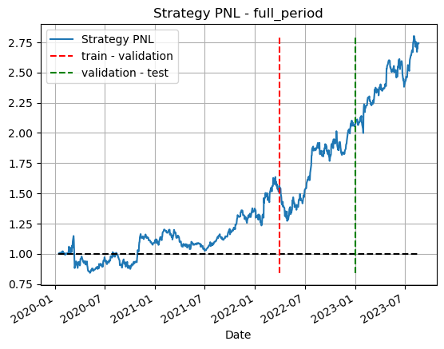

# Itau quant challenge

## :bookmark_tabs: Goals

The primary aim of this competition was to develop a quantitative investment strategy from the ground up.

## :bulb: The strategy

Our devised strategy involved utilizing news data to engage in trading activities (long or short positions) within a selection of five tech giants (Apple, Google, Meta, Amazon, and Microsoft).

News data where processed with a pre-trained language model (BERT) and then inputted wth past prices to forecast the next closing prices

## :chart_with_upwards_trend: Results

| Period    | Sharpe Ratio | Information Ratio | Annualized Vol. | p-value |
|-----------|--------------|-------------------|-----------------|---------|
| Training  | 0.88         | 0.324             | 0.26            |   9%    |
| Validation| 1.74         | 2.19              | 0.28            |   7%    |
| Test      | 2.09         | 2.24              | 0.21            |   4%    |
| Total     | 1.20         | 0.91              | 0.26            |   1%    |

Our total dataset had news from 2019 to 2023. We splitted the train-validation-test period as

* **Train period** January 1st 2020 - April 1st 2022
* **Validation period** April 1st 2022 - December 30th 2022
* **Test period** January 1st 2023 - August 23rd 2023

Our main metrics were sharpe ratio and p-value (Probabilistic sharpe-ratio). 

To compute information ratio, the selected benchmark was the american technoly index, S&P North American Technology Sector Index (SPGSTI).